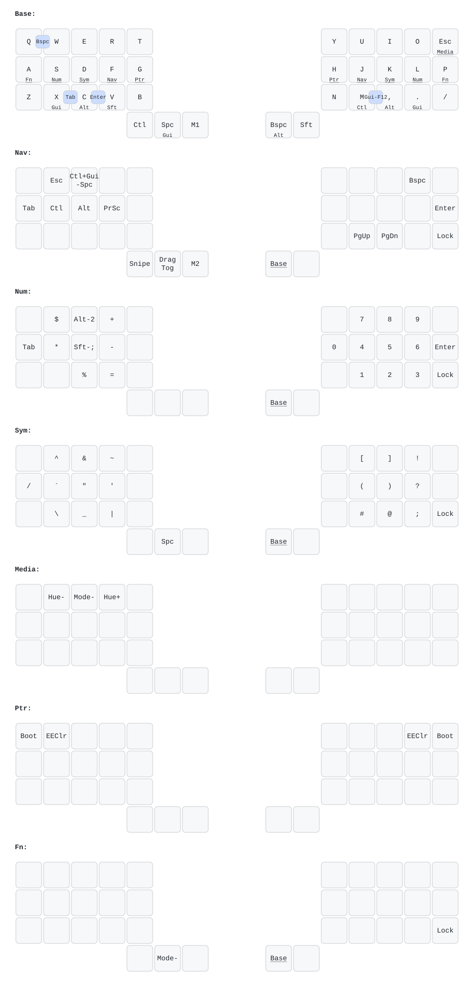

# QMK Userspace — Charybdis Nano

Personal QMK Userspace, building the `vendor` keymap for the **Charybdis Nano**
(`bastardkb/charybdis/3x5`). See the official docs for background:
[docs.bastardkb.com/fw/compile-firmware.html](https://docs.bastardkb.com/fw/compile-firmware.html).

## Keymap

The keymap lives in
[`keyboards/bastardkb/charybdis/3x5/keymaps/vendor/`](keyboards/bastardkb/charybdis/3x5/keymaps/vendor/).
Visual references are in [`docs/`](docs/) — an [ASCII view](docs/keymap.md) and a
rendered diagram:



## Build

CI (GitHub Actions) builds on every push and attaches the firmware artifact.

Locally, with the `qmk` CLI configured for this userspace:

```sh
qmk compile -kb bastardkb/charybdis/3x5 -km vendor
```

Flash by double-tapping reset and copying the resulting `.uf2` to the drive.
